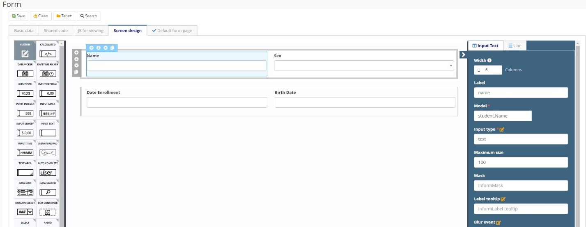

title: Formulário
Description: Formulário
# Formulário

Permite a construção de interfaces de usuário através da combinação de componentes Drag and Drop previamente definidos e o uso de recursos CSS, Angular JS e JavaScript.

## Características

   * Cada formulário pode conter uma ou mais páginas e cada página tem um HTML, um JS de controlador angular e uma coleção de dependências (o layout da tela é comum a todas as páginas);

   * O desenho da tela contém uma coleção de linhas e cada linha do desenho da tela pode ter um ou mais componentes (com uma ou mais propriedades);

   * Páginas previamente configuradas no sistema:

     -  **Página padrão**

       *   Página usada para iniciar o serviço SM, pesquisar os dados dentro do banco
           de dados e registrar diretamente nele.

     -  **Página CRUD**

       *   Página criada automaticamente pelo Objeto de negócio, com as funções
           básicas.

     -  **Página de processo**

       *   Página para processos do sistema SM associados a processos de negócios,
           usados para iniciar um Processo de Negócio Neuro.

     -  **Página de tarefa**

       *   Execução de um projeto de fluxo de trabalho/Desenho ESI, renderizando um
           formulário Neuro na tela do ticket.

     -  **Página de relatório**

       *   Página de relatório para relatórios gerados pelo aplicativo, inclui
           dependências específicas para a execução de um relatório JASPER.

## Antes de começar

É necessário ter criado a Aplicação Neuro.

## Procedimento

1.  Acessar a funcionalidade pelo menu de navegação Neuro \> Gerenciamento \> Formulário;

2.  Clicar em “Cadastrar”;

3.  Completar os campos disponíveis em “Dados Básicos”. Nesta aba, o usuário
    deve informar os dados básicos dos formulários, como a **Aplicação** a qual
    o formulário pertence, o **Nome**, **Descrição**, **Regras de Negócio**
    (para Validação e para SM, se houver) e a **Pasta**, que é um agrupamento de
    formulários no servidor, para fins de organização e marca se o Formulário é
    para ser **Mostrado como um widget de SM**;
    
    

    Figura 1 - Formulário

    !!! Abstract "ATENÇÃO"

        A versão é incrementada automaticamente pelo sistema sempre que uma nova versão do formulário é criada.

4. Adicionar página

    

    Figura 2 - Adicionar página
    

5. As abas geradas terão a seguinte estrutura:

    * Propriedades: dados gerais

    

    Figura 3 - Dados gerais
    

    * HTML: estrutura de página HTML

    

    Figura 4 - HTML
    

    * Controlador: código do controlador referente ao formulário

    

    Figura 5 - Controlador
    

    •	Dependências: as dependências da aplicação são reportadas. O nome da dependência e o caminho no qual ela está localizada devem ser     inseridos. O usuário também deve informar se será injetado no controlador.

    

    Figura 6 - Dependências

1.  Desenhar a tela. Para criar o design da tela, clique em Editar tela ou
    navegue até a guia do sistema Desenhar Tela, que se abre automaticamente.

    *   Arraste os componentes localizados na paleta esquerda para o centro da tela
    de acordo com a forma que você deseja criar o formulário. Os componentes são
    organizados em linhas e colunas, e as linhas têm uma largura de 12 colunas.
    Isso significa que em cada linha você pode inserir até 2 componentes com
    largura 6, ou até 3 componentes com largura 4, por exemplo. Não é
    obrigatório preencher a fileira inteira.

    *   Você também pode criar guias nos formulários. Para isso, vá para o menu de
    guias e escolha as guias horizontalmente ou verticalmente. As guias serão
    adicionadas na tela e você pode criar a tela com os componentes em cada
    guia.

    

    Figura 7 - Design

7.	Clique em Salvar para executar as alterações. Você pode salvá-lo na versão original (versão atual) ou em uma nova versão.

!!! Abstract "JS para visualização"

    Essa guia tem a capacidade de adicionar variáveis no escopo do JavaScript na tela que é aberta quando você clica em Exibir         Tela. Mais informações podem ser encontradas em Desenvolver Aplicações

!!! tip "About"

    <b>Product/Version:</b> CITSmart | 8.00 &nbsp;&nbsp;
    <b>Updated:</b>03/13/2019 - Anna Martins  

