Title: O que há de novo no CITSmart 8.0?
Description: Descreve O que há de novo no CITSmart 8.0

# O que há de novo no CITSmart?

## Versão 8.0.2.0
 
### CENTRO DE EXPERIÊNCIA

- Melhorias de UI/UX no Centro de Experiência (CE) com novo menu de acesso aos CEs e possibilidade de redimensionamento do cabeçalho e logo, dentre outras;

- Implementação do recurso de busca no Centro de Experiência para o contexto de Conhecimentos, Serviços e Notícias;

- Melhorias de UI/UX do Widget de Portfólios e Serviços com acesso rápido ao serviço desejado;

### TICKETS

- Novo widget "My Tickets" com lista de todos os tickets que o usuário abriu ou para aprovação, incluindo novas colunas personalizáveis; :new:

- Nova tela de visualização de ticket do usuário final, com comentários, reabertura, anexos etc; :new:

- Melhorias de performance e UI/UX no painel de listagem de tickets do atendente, com filtros rápidos, novo menu lateral e a inclusão da nova coluna de descrição;

- Melhorias de UI/UX na Tela de tickets e opções internas para capturar, delegar, reclassificar, suspender etc;

### WORKFLOW

- Componentes dinâmicos no desenho de fluxo;

### GERAIS

- Autenticação Oauth2;

- Patch de corretivas;

- Melhorias de performance e funcionalidades no Smartchat que permite além da comunicação entre atendente e solicitante, a comunicação entre atendentes;

## Versão 8.0

Uso da Logomarca e Login
------------------------

O uso da imagem CITSmart foi otimizada para melhorar o uso de dados, bem como a aplicação dentro da solução, tornando mais simples, leve e adequada para os novos direcionamentos do produto.

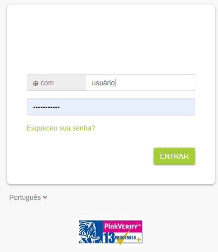

Centro de Experiência
---------------------

Através do Centro de Experiência é possível construir portais de relacionamento com identidade visual própria para clientes, fornecedores e colaboradores, promovendo visibilidade e colaboração.

Cada Centro de Experiência possui páginas dinâmicas com a opção de widgets de:

*   Portfólios
*   Requisições
*   Aprovações
*   Centro de Conhecimento
*   Aplicações Neuro
*   Workspaces
*   Notícias
*   Notificações
*   Pesquisas
*   Youtube
*   Imagens
*   Menu
*   Lista
*   Texto
*   Chat
*   Voip
*   Entre outros

Centros de Experiência poderão ser criados de acordo com perfis de acesso e necessidades das áreas de negócio.

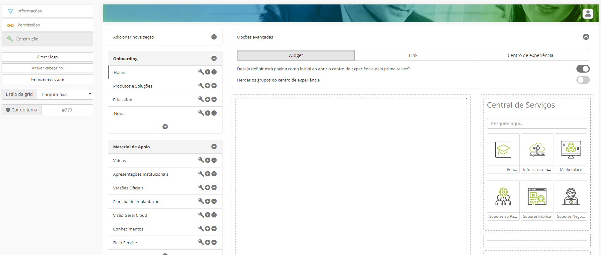

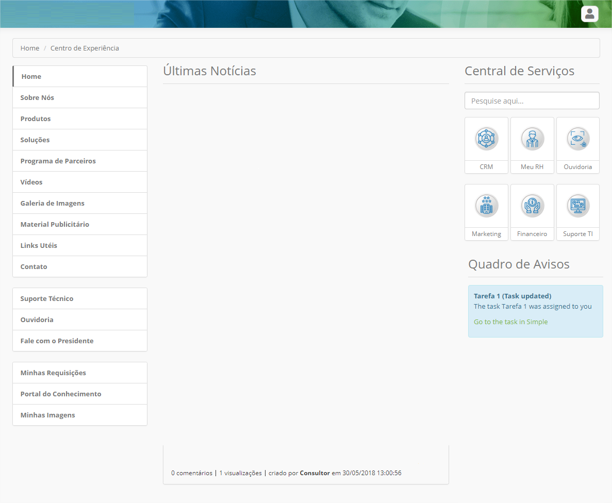

### Widget de Portfólio

É utilizado no Centro de Experiência para listar os Portfólios com seus Serviços e Requisições, podendo substituir o uso do portal de serviços.

### Widget Minhas Requisições

Lista os tickets do usuário logado **(a.)**, disponibiliza um histórico do atendimento com linha do tempo **(b.)** e permite ao solicitante adicionar notas e comentários **(c.)**, notificar o atendente por e-mail ou também é possível utilizar o **bate papo** com o atendente **(d.)**.

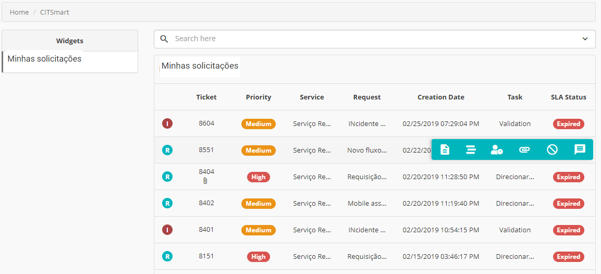

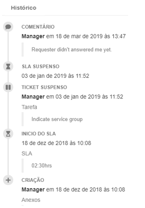

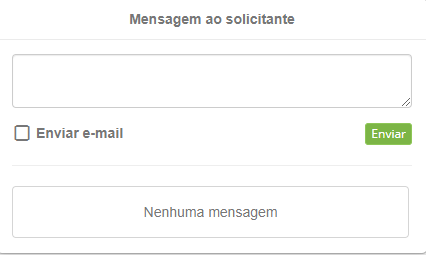

Saiba mais sobre o [Centro de Experiência][1]

### Widget Minhas Aprovações

Aprovar um ticket pelo CITSmart ficou mais simples, basta clicar no ícone aprovar **(a.)**, é possível visualizar os detalhes do ticket e aprovar ou não **(b.)**.
 

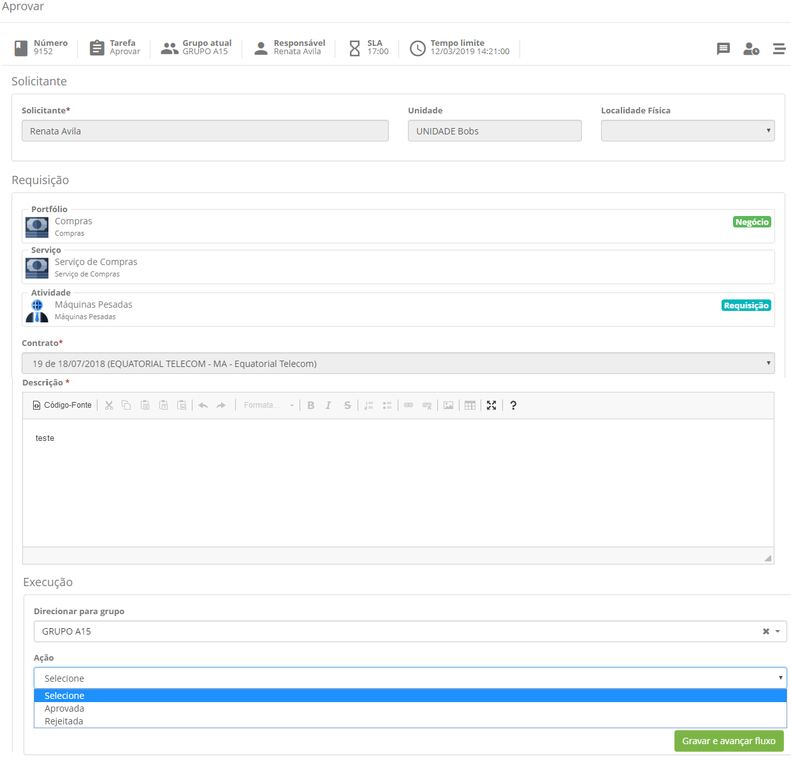

Menus
----

Internamente os menus sofreram reorganização e agora estão dispostos à esquerda, com possibilidade de consulta e ocultação, melhorando o espaço de trabalho na plataforma.

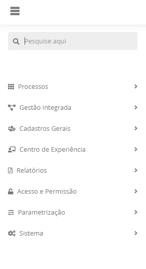

Smart Decisions
---------------

Permite manter e visualizar áreas de trabalho por usuário com :

* Widgets de dashboards
* Relatórios nativos e
* Relatórios construídos na plataforma. 

**Cada usuário pode configurar sua própria área com uma ou mais abas.**

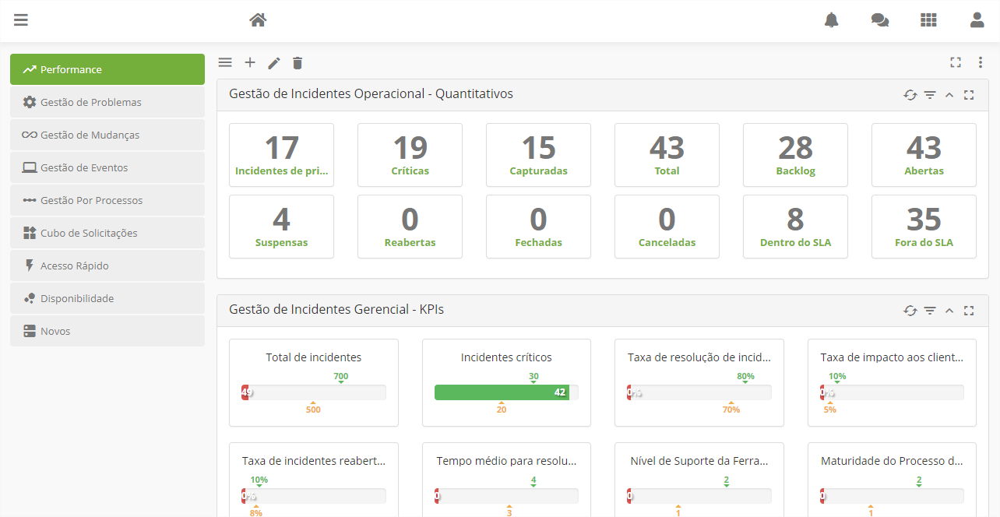

Acesso Rápido
-------------

Novos ícones e área de acesso rápido aos processos e portais foram disponibilizados no área superior da plataforma de forma a tornar mais simples e prático o acesso às funcionalidades do CITSmart. 

Gestão de Tickets
-----------------

Seu novo layout apresenta informações de forma mais estruturada em um menu lateral com opção de ocultar, uma melhoria significativa de performance e experiência do usuário **(a.)** . Na criação de tickets há uma nova busca multinível que permite pesquisar por portfólios, serviços e atividade de forma visual e rápida (não é  mais disponibilizado filtro por categoria) **(b.)**, É possível acompanhar graficamente a execução do fluxo **(c.)**. O atendente pode enviar mensagem ao solicitante e notificá-lo por e-mail **(d.)**.

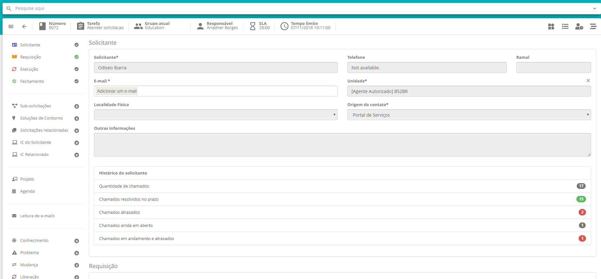

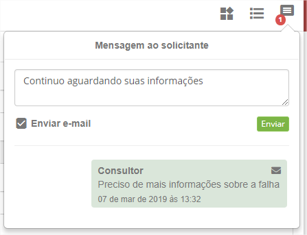

O registro de ocorrências foi substituído por um registro de notas e comentários com a possibilidade de notificar o solicitante por e-mail, lançar horas de atendimento e controlar a visualização dos registros **(a.)**, e toda a execução do fluxo e registros do atendimento como a captura, delegação, suspensão, SLA etc são exibidos em um histórico no formato de linha do tempo. As mensagens com o solicitante também são guardadas aqui **(b.)**.

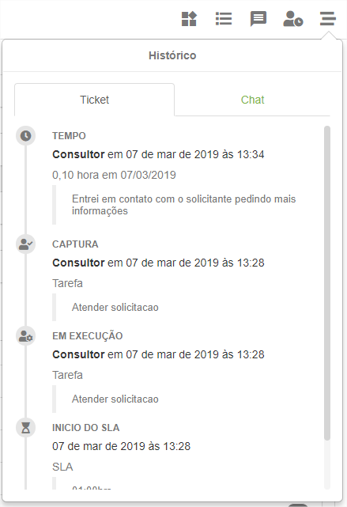

Agora, assim que uma nova Solução de Contorno é criada, automaticamente é disparada uma notificação para o responsável pelo Incidente **(a.)** e é possível visualizar a solução de contorno e copiar o conteúdo para o fechamento do incidente, preenchendo a causa e solução resposta **(b.) (c.)**.

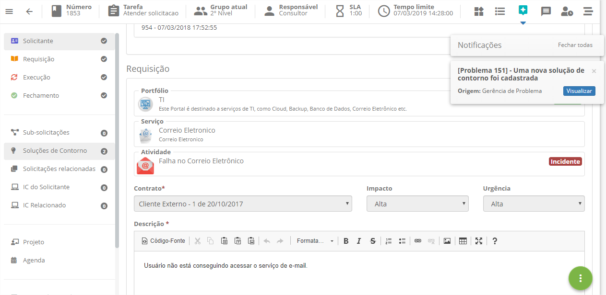

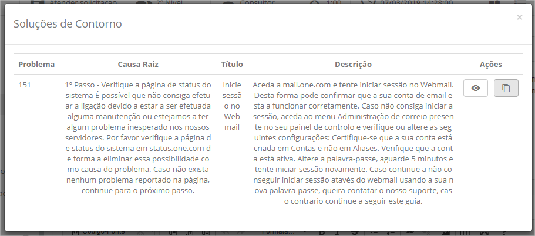

Simple - Gestão Ágil
--------------------

O Simple, que trouxe o poder da gestão ágil para a plataforma CITSmart, desenvolvido para ajudar as equipes a serem mais colaborativas e participativas, aumentando a produtividade e dando mais autonomia e visibilidade aos membros de uma forma mais simples e prática **(a.)**. Cada time pode ter um ou mais workspace **(b.)** e criar sprints com kanbans e fases, de acordo com cada necessidade **(c.)**.

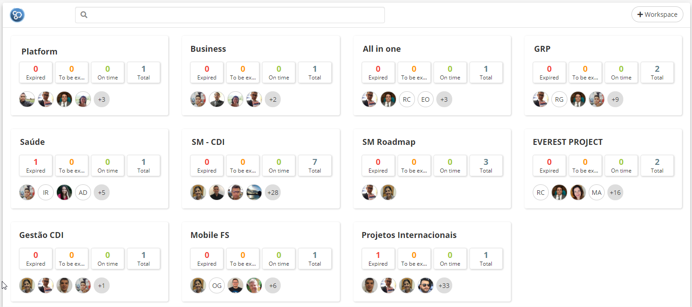

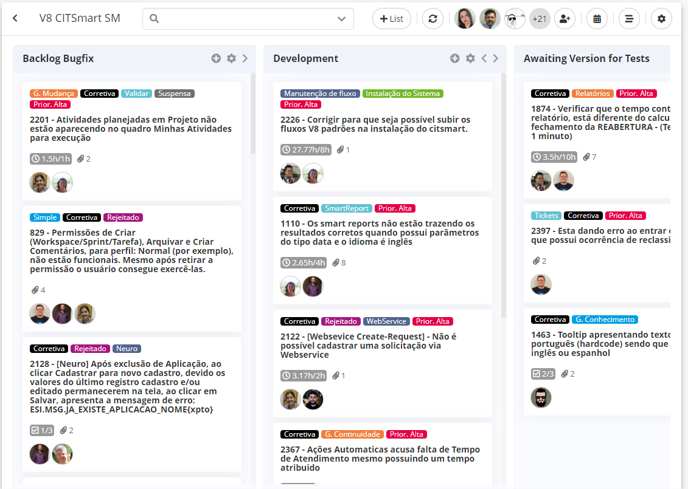

Cada tarefa pode ter um ou mais membro. É possível adicionar:

*   Checklists
*   Comentários
*   Estimativa
*   Horas trabalhadas
*   Tags
*   Arquivos
*   Ativar notificações etc.

Saiba mais sobre o [Simple][2]

Gerenciamento de Problemas
--------------------------

O Gerenciamento de Problemas foi redesenhado para dar mais agilidade, facilidade e praticidade ao trabalho das equipes. Com um novo painel de listagem e acompanhamento é possível alterar colunas de exibição, ativar atualização automática, visualizar andamento do fluxo, pesquisar registro de problemas, acessar lista de relatórios dinâmicos etc.

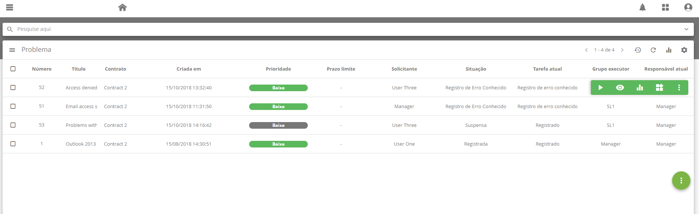

Para facilitar a tratativa do problema, uma sequência de passos foi estruturada em um menu lateral. 

*   Informações do Solicitante
*   Incidentes relacionados ao problema
*   Problema
*   Diagnóstico
*   Solução
*   Revisão e Fechamento

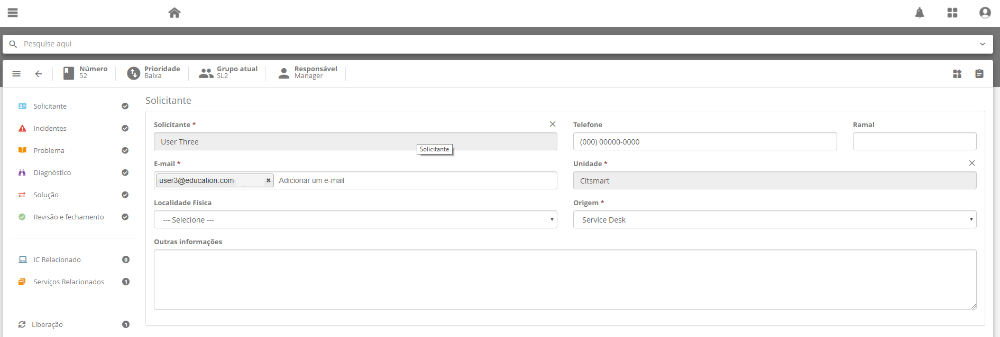

Agora é possível vincular e visualizar em uma mesma tela a lista de incidentes que geraram o problema **(a.)**. O registro de problema passou a utilizar o conceito de portfólio de templates **(b.)**, os templates são pré-cadastrados com fluxo de atendimento, grupo responsável, status etc, tornando mais prática a criação, classificação e atendimento dos problemas **(c.)**.

Ao Vincular um Serviço ao Problema é possível visualizar o Mapa do Serviço e a Lista de seus ICs.**(a.)**, Basta dois clicks no IC para visualizar os detalhes **(b.)** e a partir da lista de ICs é possível vincular os que estão relacionados ao problema **(c.)**.

Uma nova área de diagnóstico foi criada e permite que através do Simple, mais pessoas ou equipes trabalhem colaborativamente na análise do problema, trazendo agilidade e eficiência **(a.)**, O registro de erro conhecido, causa raiz e soluções de contorno está mais fácil. Uma nova notificação é enviada ao responsável pelo incidente assim que cada solução de contorno é registrada **(b.)**.

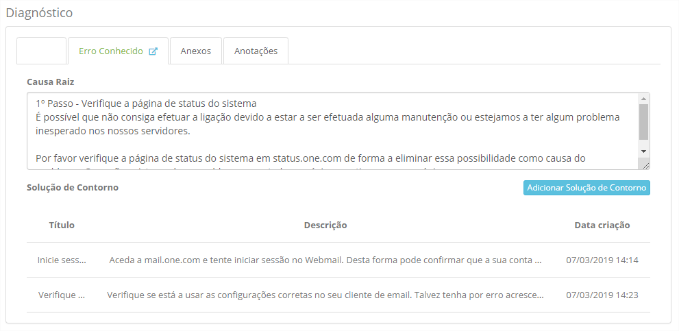

Também há uma nova área de Solução com vínculo direto ao Simple e aos registros de mudança, permitindo que o desenho, desenvolvimento e implantação da solução seja mais ágil e colaborativo, atingindo melhores resultados **(a.)**, a guia de Revisão e Fechamento permite informar se o problema foi resolvido com sucesso ou não. Também é possível registrar lições aprendidas, notas etc. e abrir sprints para problemas cuja revisão envolva mais pessoas ou equipes **(b.)**.

Saiba mais sobre [Gerenciamento de Problema][3]

Gerenciamento de Configuração e Ativos
--------------------------------------

Com o objetivo de tornar a busca e visualização de ICs mais rápida e prática, o painel de Gerenciamento de Configuração e Ativos foi reformulado considerando a melhor experiência para o usuário, A nova busca permite filtrar por grupos, tipos, alertas e identificação. 

O painel dispõe de um novo Widget de Grupos que permite o acesso e navegação entre as estruturas do CMDB **(a.)**, O Widget de Alertas exibe a lista de ICs com o quantitativo de Incidentes, Problemas, Mudanças e Liberação abertos **(b.)**, os tipos de ICs também estão dispostos em um novo Widget com o quantitativo de ICs que possuem **(c.)** e ao acessar o tipo, a lista de ICs é exibida de forma agrupada e com o quantitativo de ICs de acordo com a identificação **(d.)**.

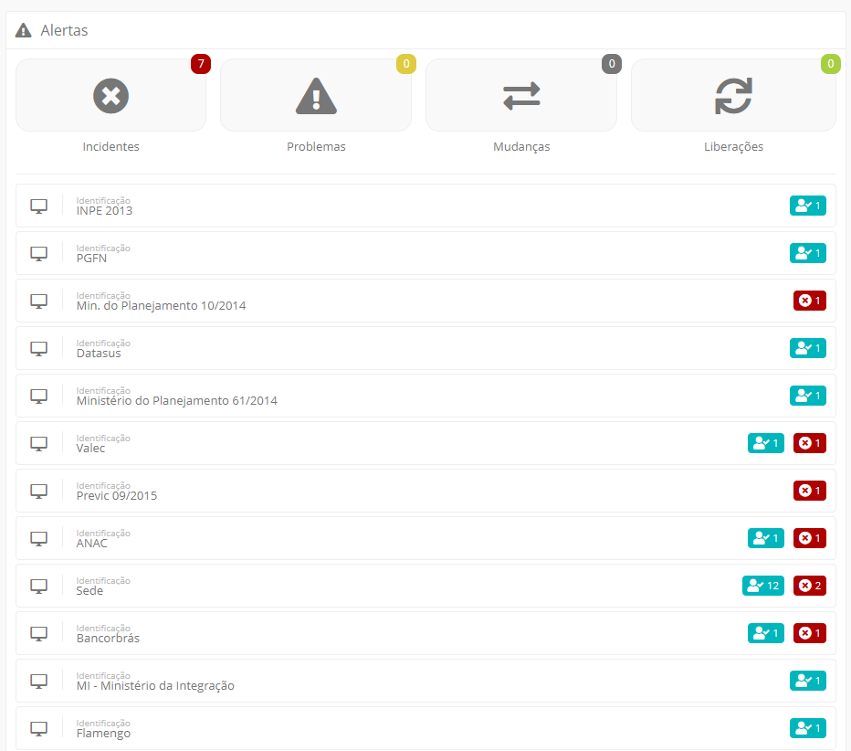

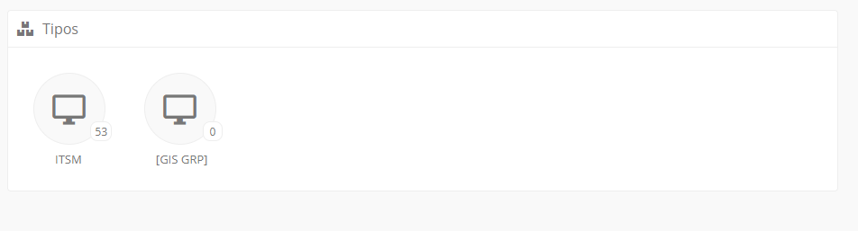

A visualização do IC também foi otimizada. Agora as principais informações e características do IC são exibidas na área Geral **(a.)** e as informações de garantia também são exibidas em um novo Widget **(b.)**.

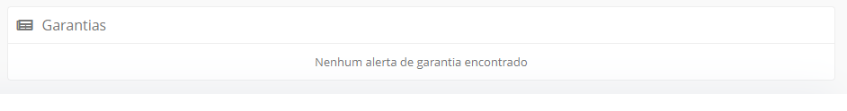

Saiba mais sobre [Gerenciamento de Configuração][4]

Gerenciamento de Mudanças
-------------------------

O CITSmart evoluiu o Gerenciamento de Mudanças para dar mais agilidade, segurança e praticidade as mudanças em ambientes que vão além da TI . Com um novo painel de listagem é possível alterar colunas de exibição, ativar atualização automática, visualizar andamento do fluxo, pesquisar registro, acessar lista de relatórios dinâmicos etc.

Para facilitar o atendimento, a seguinte sequência de passos foi estruturada no menu lateral:

*   Informações do solicitante
*   Informações da requisição de mudança
*   Planejamento da mudança
*   Plano de reversão
*   Revisão e fechamento
*   ICs relacionados

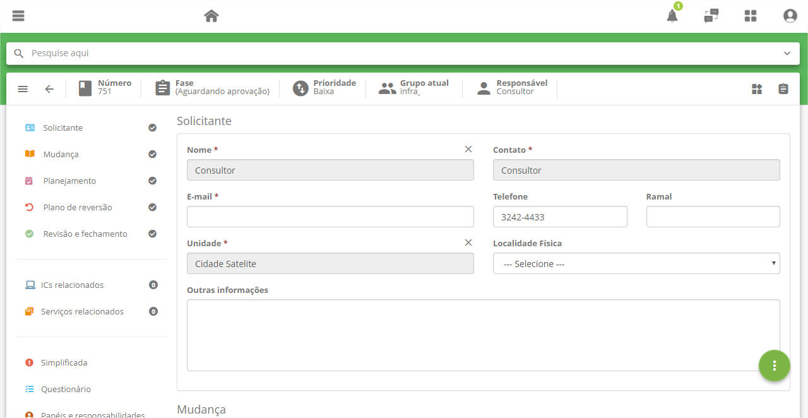

Para facilitar a organização e a classificação dos registros de mudança, o CITSmart passou a utilizar o conceito de Portfólio de Mudanças, permitindo pré-configurar templates com fluxo de atendimento, calendário, grupos responsáveis etc **(a.)**, e a classificação da mudança se tornou muito mais simples e ágil **(b.)**.

Também é possível vincular aos templates os formulários de análise ágil de risco. Cada template de mudança poderá utilizar um formulário com perguntas e pesos. De acordo com a análise, um gráfico de risco é apresentado **(a.)**. O Planejamento, Reversão, Revisão e Fechamento da Mudança agora contam com um painel de gestão ágil (Conceito "Simple"), assim várias equipes podem executar tarefas de forma rápida, transparente e colaborativa **(b.)**.

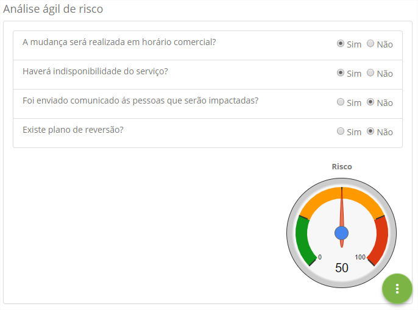

Na Revisão e fechamento da mudança, além de informar se a mudança foi realizada com sucesso ou não, também é possível vincular um formulário para análise da qualidade da mudança, além do vínculo com Incidentes, Problemas, Lições aprendidas etc.

Saiba mais sobre [Gerenciamento de Mudança][5]

## Gerenciamento de Liberação e Implantação

O processo de Gerenciamento de Liberação e Implantação também passou por evoluções. O painel de listagem segue o mesmo padrão apresentado nos processos de Gerenciamento de Problema e de Mudança.

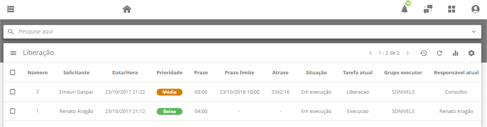

No menu lateral foi estruturado uma sequência de passos para facilitar o acompanhamento da liberação **(a.)**,  e as mudanças empacotadas para liberação são apresentadas na mesma tela, facilitando o acompanhamento **(b.)**. O Planejamento e a Implantação agora contam com um painél de Gestão Ágil(Conceito "Simple"), facilitando o envolvimento e a colaboração de várias equipes **(c.)**.

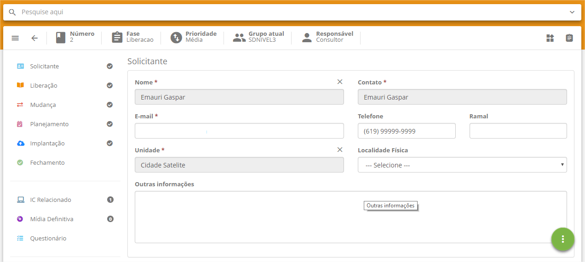

## Business Intelligence

Um dos módulos opcionais nesta nova versão é o Smart Analytics que permite o uso da estrutura de BI do Saiku Community para análise de dados de Tickets, Mudanças, Releases etc **(a.)**, são disponibilizadas várias visões de gráficos e tabelas, com a possibilidade de filtros e exportação para csv e pdf **(b.)**.

## Trilha de Auditoria

As trilhas de auditoria foram criadas para dar mais transparência do uso de dados e segurança do nosso sistema, existem três opções de Auditoria: de **dados**, de **acesso** e de **chave**. 

Saiba mais sobre [Auditoria do Sistema][6]

**Auditoria de dados.**

Nesta opção de auditoria é apresentado o histórico de todos os dados de alteração, inclusão e exclusão realizadas no sistema.

**Auditoria de Acesso**

Nesta opção é apresentado o histórico dos acessos ao sistema (entradas e saídas)

**Auditoria de Chave**

Nesta opção de auditoria informa as licenças utilizadas para a validação do sistema.

## App CITSmart GO

O App CITSmart GO foi criado para dar mais flexibilidade e agilidade em atendimentos realizados em campo. As funcionalidades do app podem ser executadas offline e depois sincronizadas de forma fácil.

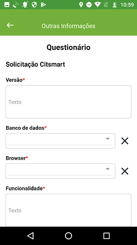

Saiba mais sobre [CITSmart GO][7]

## App CITSmart Experience

O App CITSmart Experience foi criado para que as facilidades e benefícios da solução CITSmart possam ser acessados também via dispositivos móveis, esta nova versão inclui notificações para o sistema operacional Android e a possibilidade de confirmação de atendimento via assinatura.

Saiba mais sobre [Mobile CITSmart Experience][8]

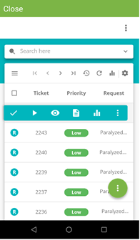

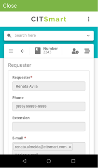

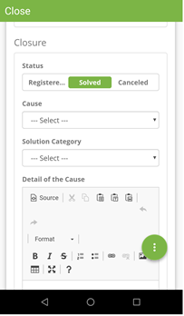

[1]:/pt-br/citsmart-platform-8/processes/knowledge/use/create-experience-center.html
[2]:/pt-br/citsmart-platform-8/additional-features/project-management/simple-agile-management/simple-agile-management.html
[3]:/pt-br/citsmart-platform-8/processes/problem/overview.html
[4]:/pt-br/citsmart-platform-8/processes/configuration/overview.html
[5]:/pt-br/citsmart-platform-8/processes/change/overview.html
[6]:/pt-br/citsmart-platform-8/platform-administration/logs-and-auditing/system-audit.html
[7]:/pt-br/citsmart-platform-8/additional-features/mobile-and-field-service/apps/citsmart-field-service-manual.html
[8]:/pt-br/citsmart-platform-8/additional-features/mobile-and-field-service/apps/citsmart-app.html

!!! tip "About"

    <b>Product/Version:</b> CITSmart | 8.00 &nbsp;&nbsp;
    <b>Created:</b>03/14/2019 - André Fernandes

